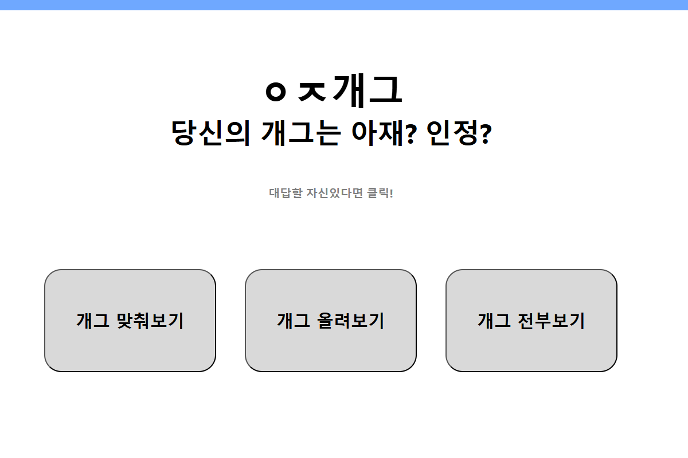

# A-JAE GAG

# **프로젝트 소개**

---

<aside>

## 📄 **아재 개그**

- 썰렁 개그를 올리고 평가받는, 기본적인 CRUD를 구현한 사이트입니다.
</aside>

# 주요기능

---

1. 로그인 기능 -기본적으로 로그인 기능에서 필요로 하는 회원가입, 
2. 개그 올리기 - 개그의 제목과 내용, 정답을 적은 뒤 서버에 등록할 수 있습니다. (회원전용 기능)
3. 개그 풀기 - 시간 안에 제목과 내용을 보고 개그의 정답을 맞춰야합니다. 시간 안에 맞추지 못하면 해당 개그의 정답률이 내려가며 정답이 노출됩니다. 이는 서버에 반영됩니다.
4. 개그 평가하기 - 해당 개그가 재밌었는지 썰렁했는지를 비교하는 기능입니다. 일반적인 커뮤니티 사이트의 추천/비추천과 같은 맥락으로 사용됩니다. (회원전용 기능)
5. 개그 맞춰보기 - 게시판에서 원하는 개그를 찾아갈 수 있지만 메인화면에서 빠르게 무작위 개그를 찾아볼 수 있습니다. 해당 기능을 사용하면 전체 리스트에서 완전 무작위 목록을 찾아옵니다.

# 배포 환경

---

Vercel(백엔드 지원 종료로 인한 배포 중단)

# 프로젝트 구조

---

<aside>

src  
├── assets  
├── components  
│ ├── global  
│ │ └── Header.tsx  
│ ├── GagBox.tsx  
│ ├── GagListComp.tsx  
│ ├── GagModal.tsx  
│ ├── LoginModal.tsx  
│ ├── MainButton.tsx  
├── pages  
│ ├── GagDetail.tsx  
│ ├── GagList.tsx  
│ ├── Main.tsx  
│ └── MyGag.tsx  
└── utils  
  └── api  
    ├── api.ts   
    └── axios.ts  

</aside>

# 개발 환경

---

